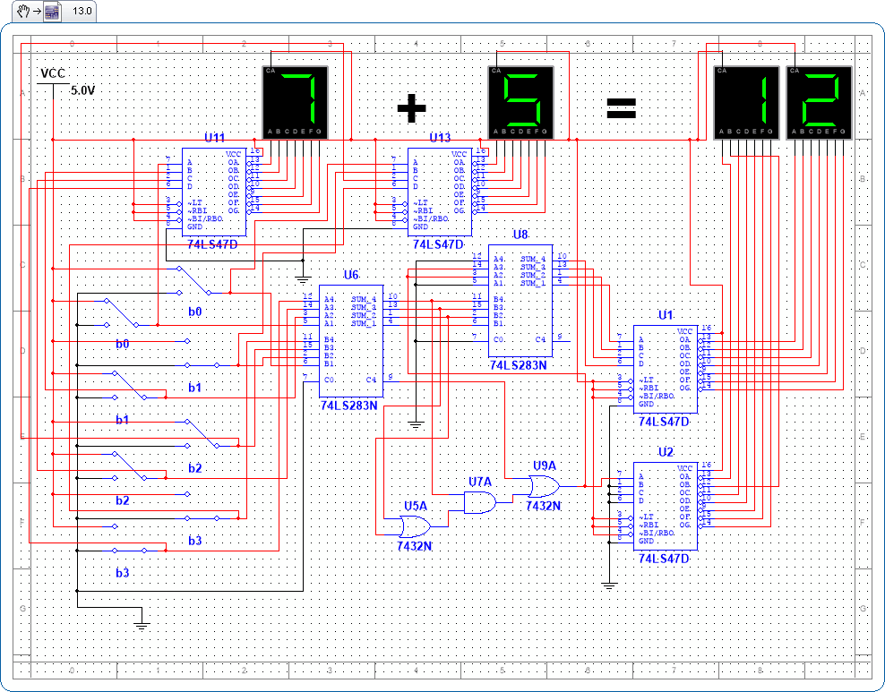

# Digital Logic Design Laboratory Exercises (ΕΥ121)

## University of Thessaly - Department of Computer Science

This repository features laboratory exercises for the Digital Logic Design course (ΕΥ121), conducted by the Department of Computer Science at the University of Thessaly. The exercises are crafted to impart practical knowledge of digital electronics, covering a broad spectrum of topics from basic logic gates to complex sequential circuit design and analysis through simulation.

### Course Overview

Digital Logic Design covers foundational and advanced aspects of digital electronics, emphasizing both theoretical knowledge and practical skills. Students will explore the design and functionality of logic gates, combinational and sequential circuits, and digital arithmetic operations, culminating in the understanding of circuit simulation and analysis.

### Lab Exercises

#### Lab Exercise 1: Basic Logic Gates

- Introduction to basic logic gates and their practical applications.

#### Lab Exercise 2: Advanced Logic Operations

- Exploration of advanced logic operations using NAND, NOR, and XOR gates.

#### Lab Exercise 3: Combinational Logic Circuits

- Design and analysis of combinational logic circuits for specified functions.

#### Lab Exercise 4: Traffic Control and Arithmetic Circuits

- Implementation of traffic control systems and arithmetic operations using digital circuits.

#### Lab Exercise 5: Multiplexers, Encoders, and Decoders

- Practical exercises on multiplexers, encoders, and decoders, including circuit design and simulation.

#### Lab Exercise 6: Sequential Circuit Design

1. **Circuit Simulation and Analysis**: Implement and simulate the given circuit in Multisim, explaining its operation and determining the output after a specified number of clock cycles.
2. **Sequential Circuit with D Flip-Flops**: Design a sequential circuit including two D flip-flops, inputs x and y, and output z. Construct the state table and state diagram based on the given next-state equations.
3. **Design of a Sequential Circuit with a Specific State Table**: Design and simulate a sequential circuit based on the provided state table, involving state transitions and outputs depending on the input X.

### Getting Started

To access these lab exercises. Ensure you have Multisim or a similar circuit simulation software installed to perform the exercises effectively.

## Author
Paschalis Moschogiannis (Contact: pmoschogiannis@uth.gr)

